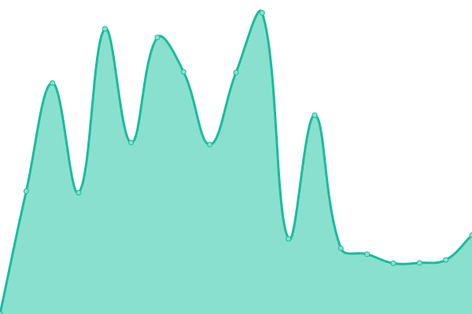
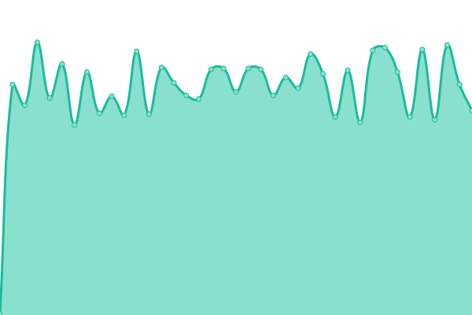
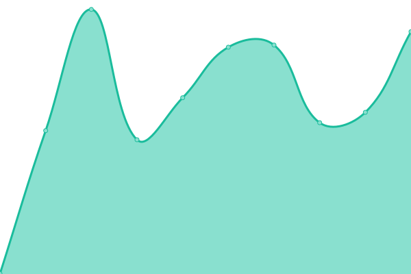

# [📈 Live Status](https://fcstatus.nijika.in): <!--live status--> **🟧 Partial outage**

This repository contains the open-source uptime monitor and status page for [ForestCraftMC](https://fcstatus.nijika.in), powered by [Upptime](https://github.com/upptime/upptime).

With [Upptime](https://upptime.js.org), you can get your own unlimited and free uptime monitor and status page, powered entirely by a GitHub repository. We use [Issues](https://github.com/ForestCraftMC/status/issues) as incident reports, [Actions](https://github.com/ForestCraftMC/status/actions) as uptime monitors, and [Pages](https://fcstatus.nijika.in) for the status page.

<!--start: status pages-->
<!-- This summary is generated by Upptime (https://github.com/upptime/upptime) -->
<!-- Do not edit this manually, your changes will be overwritten -->
<!-- prettier-ignore -->
| URL | Status | History | Response Time | Uptime |
| --- | ------ | ------- | ------------- | ------ |
|  [LittleSkin 用户中心](https://littleskin.cn/user) | 🟩 Up | [little-skin.yml](https://github.com/ForestCraftMC/status/commits/HEAD/history/little-skin.yml) | 

 1520ms
     
 | 

<a href="https://fcstatus.nijika.in/history/little-skin">94.02%</a>
    

|  [LittleSkin 认证 API](https://littleskin.cn/api/yggdrasil) | 🟩 Up | [little-skin-api.yml](https://github.com/ForestCraftMC/status/commits/HEAD/history/little-skin-api.yml) | 

 366ms
     
 | 

<a href="https://fcstatus.nijika.in/history/little-skin-api">94.03%</a>
    

|  Forest Craft 服务器 | 🟥 Down | [forest-craft.yml](https://github.com/ForestCraftMC/status/commits/HEAD/history/forest-craft.yml) | 

 1875ms
     
 | 

<a href="https://fcstatus.nijika.in/history/forest-craft">77.03%</a>
    

|  OpenFrp Tunnel 1 | 🟥 Down | [open-frp-tunnel-1.yml](https://github.com/ForestCraftMC/status/commits/HEAD/history/open-frp-tunnel-1.yml) | 

 246ms
     
 | 

<a href="https://fcstatus.nijika.in/history/open-frp-tunnel-1">77.14%</a>
    

|  OpenFrp Tunnel 2 | 🟥 Down | [open-frp-tunnel-2.yml](https://github.com/ForestCraftMC/status/commits/HEAD/history/open-frp-tunnel-2.yml) | 

 231ms
     
 | 

<a href="https://fcstatus.nijika.in/history/open-frp-tunnel-2">77.23%</a>
    

|  OpenFrp Tunnel 3 | 🟥 Down | [open-frp-tunnel-3.yml](https://github.com/ForestCraftMC/status/commits/HEAD/history/open-frp-tunnel-3.yml) | 

 277ms
     
 | 

<a href="https://fcstatus.nijika.in/history/open-frp-tunnel-3">75.90%</a>
    

|  [Cloudflare Public DNS](https://1.1.1.1/dns-query) | 🟩 Up | [cloudflare-public-dns.yml](https://github.com/ForestCraftMC/status/commits/HEAD/history/cloudflare-public-dns.yml) | 

 23ms
     
 | 

<a href="https://fcstatus.nijika.in/history/cloudflare-public-dns">100.00%</a>
    

<!--end: status pages-->

[**Visit our status website →**](https://fcstatus.nijika.in)

## 📄 License

- Powered by: [Upptime](https://github.com/upptime/upptime)
- Code: [MIT](./LICENSE) © [Anand Chowdhary](https://anandchowdhary.com), supported by [Pabio](https://pabio.com)
- Data in the `./history` directory: [Open Database License](https://opendatacommons.org/licenses/odbl/1-0/)
